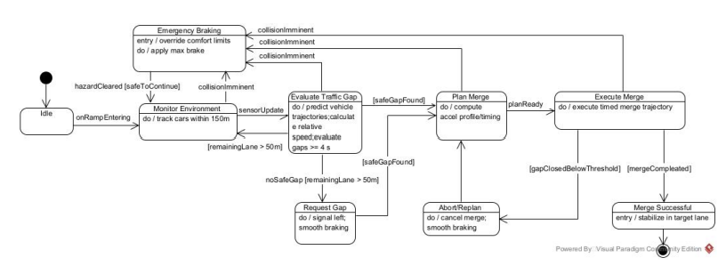
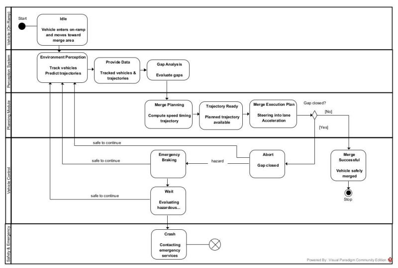
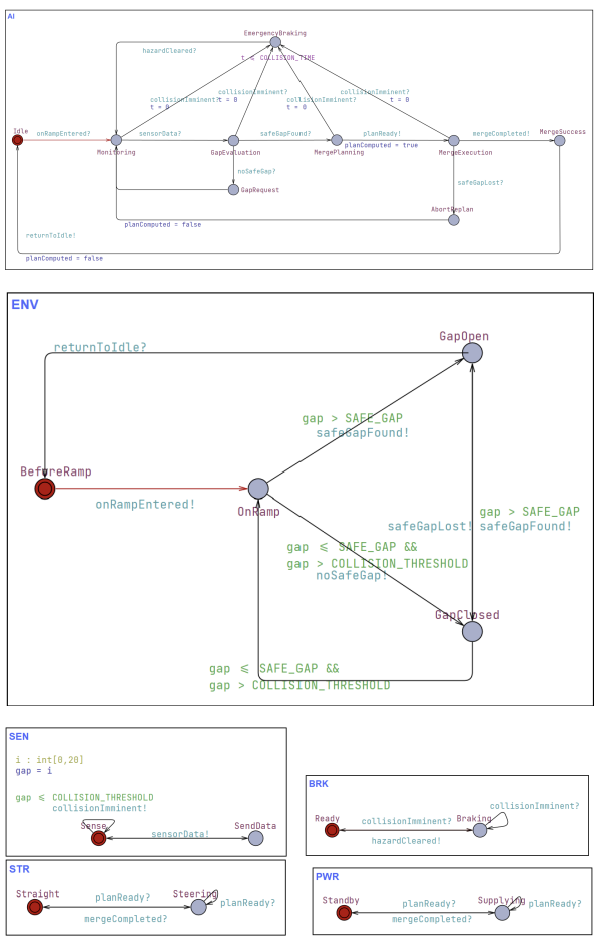
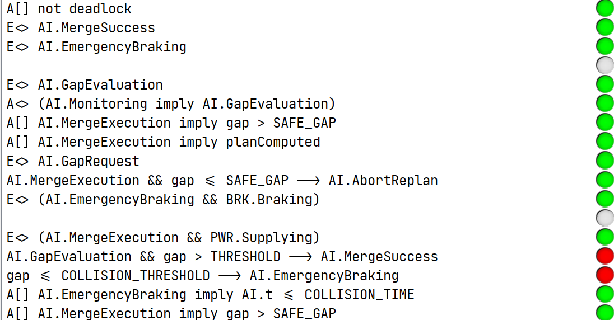

# DCPS_group5
# Model-Based Design & Verification of an Autonomous Robotaxi Highway Merge System

> **Autonomous Driving | Cyber-Physical Systems | SysML | UPPAAL | Formal Verification**

## 📌 Project Overview

This project focuses on the **model-based design and formal verification of an Autonomous Electric Robotaxi (AER) highway merge system**.

Highway merging is a safety-critical driving scenario that requires continuous coordination among perception, prediction, planning, and vehicle control functions.

The system was first designed using **SysML** to define its requirements, architecture, and behavioral logic. The behavioral model was then translated into **UPPAAL Timed Automata** to formally verify safety, reachability, subsystem coordination, and timing-related requirements.

### Project Information

- **Institution:** University of Southern Denmark (SDU)
- **Course:** Design of Reliable Cyber-Physical Systems
- **Project Type:** Team Project
- **Domain:** Autonomous Driving / Cyber-Physical Systems
- **Modeling:** SysML, Visual Paradigm
- **Formal Verification:** UPPAAL, Timed Automata, Model Checking


## 🎯 Project Objective

The objective of this project was to design and verify an autonomous highway merge system capable of:

- Monitoring surrounding vehicles
- Predicting vehicle positions and relative velocities
- Evaluating safe traffic gaps
- Planning a safe merge trajectory
- Coordinating steering, braking, and propulsion
- Aborting and replanning when a selected gap becomes unsafe
- Performing emergency braking when collision risks are detected

The overall development process was:

```text
Requirements Analysis
        ↓
SysML System Modeling
        ↓
Behavior & State Machine Design
        ↓
UPPAAL Timed Automata Modeling
        ↓
Formal Verification & Validation
```


## 🚗 Highway Merge Scenario

When the autonomous robotaxi enters a highway on-ramp, the system performs the following sequence:

1. Monitor surrounding vehicles
2. Predict vehicle positions and relative velocities
3. Evaluate available traffic gaps
4. Identify a safe gap for merging
5. Generate a merge trajectory and speed profile
6. Execute steering and propulsion commands
7. Continuously monitor safety conditions
8. Abort or initiate emergency braking if unsafe conditions occur
9. Complete the merge when all safety conditions are satisfied


## 📋 System Requirements

Seven functional and safety requirements were defined for the highway merge scenario.

| ID | Requirement |
|---|---|
| **MERGE-001** | Track vehicles in the adjacent highway lane within a 150 m range |
| **MERGE-002** | Calculate relative velocities and predicted positions over a 10-second horizon |
| **MERGE-003** | Identify a minimum safe gap of at least 4 seconds |
| **MERGE-004** | Compute a smooth acceleration profile for safe merging |
| **MERGE-005** | Initiate a gap request if no acceptable gap is found before the final 50 m of the merge lane |
| **MERGE-006** | Abort the merge and select another gap if the target gap becomes unsafe |
| **MERGE-007** | Apply maximum braking when an imminent collision is detected |


## 🏗 System Architecture

The Autonomous Electric Robotaxi was modeled as a Cyber-Physical System consisting of several interacting subsystems:

- **Sensor System**
- **AI Control Unit**
- **Brake System**
- **Steering System**
- **Power System**
- **Cloud System**
- **Human-Machine Interface (HMI)**

The **AI Control Unit** was further decomposed into:

```text
Sensor Fusion
      ↓
Perception
      ↓
Localization
      ↓
Prediction
      ↓
Planning
      ↓
Control
```

SysML was used to represent both the structural architecture and behavioral interactions of the system.

The system design included:

- Requirement Diagram
- Block Definition Diagram (BDD)
- Internal Block Diagram (IBD)
- Activity Diagram
- State Machine Diagram


## 🔄 State Machine Design

The behavioral logic of the autonomous highway merge system was modeled using a **State Machine Diagram**.

<p align="center">
  
</p>

The main operational flow consists of:

```text
Idle
  ↓
Monitoring
  ↓
Gap Evaluation
  ↓
Merge Planning
  ↓
Merge Execution
  ↓
Merge Success
```

The model also includes safety-oriented transitions for abnormal situations.

### Emergency Braking

```text
Monitoring
    ↓
Emergency Braking
    ↓
Monitoring
```

### Abort & Replan

```text
Merge Execution
      ↓
Abort / Replan
      ↓
Merge Planning
```

This structure allows the autonomous vehicle to continuously respond to dynamic traffic conditions while prioritizing collision avoidance and passenger safety.


## 🔀 Activity Diagram

The **Activity Diagram** represents the overall workflow of the highway merge maneuver and the interactions among major functional domains.

<p align="center">
  
</p>

The workflow is divided into:

- Vehicle
- Perception System
- Planning Module
- Vehicle Control System
- Safety & Emergency System

The diagram covers both the **nominal merge process and abnormal scenarios**, including:

- Environmental perception
- Gap analysis
- Merge planning
- Merge execution
- Gap loss
- Merge abortion
- Emergency braking
- Hazard monitoring and recovery


## ⏱ UPPAAL Timed Automata Modeling

The behaviors defined in the SysML models were translated into **UPPAAL Timed Automata** for formal verification.

<p align="center">
  
</p>

The UPPAAL model consists of six major templates:

| Template | Description |
|---|---|
| **ENV** | Generates surrounding traffic conditions |
| **SEN** | Acquires environmental information and detects collision risks |
| **AI** | Performs monitoring, gap evaluation, merge planning, and decision-making |
| **BRK** | Handles braking and emergency braking |
| **STR** | Controls steering and lane-changing behavior |
| **PWR** | Controls acceleration and propulsion |

### Synchronization

Interactions among the templates were implemented using **UPPAAL synchronization channels**.

For example:

```text
Sensor
   │
   │ collisionImminent!
   ▼
AI Controller
   │
   │ collisionImminent?
   ▼
Emergency Braking
```

Synchronization mechanisms allow independently modeled subsystems to coordinate their behavior.

### Timing Constraints

Clock variables, guards, and state invariants were introduced to model real-time requirements.

For example, emergency braking behavior was constrained to ensure that collision threats are handled within a predefined response time.


## 🔍 Formal Verification

The system was evaluated using the **UPPAAL Model Checker**.

A total of **14 verification queries** were designed to evaluate:

- Deadlock freedom
- State reachability
- Safe-gap constraints
- Merge-plan generation
- Abort/Replan behavior
- Emergency braking
- Powertrain coordination
- Timing constraints

### Verification Results

<p align="center">
  
</p>

**12 out of 14 verification queries were successfully satisfied.**

Representative verification properties include:

### Deadlock Freedom

```text
A[] not deadlock
```

Verifies that the system cannot enter a state in which all components become permanently blocked.

### Successful Merge Reachability

```text
E<> AI.MergeSuccess
```

Verifies that there exists an execution path in which the vehicle successfully completes a highway merge.

### Emergency Braking Reachability

```text
E<> AI.EmergencyBraking
```

Verifies that the AI Controller can reach the Emergency Braking state when a collision risk is detected.

### Safe Gap during Merge Execution

```text
A[] AI.MergeExecution imply gap > SAFE_GAP
```

Verifies that merge execution only occurs when the available traffic gap satisfies the predefined safety threshold.

### Merge Plan before Execution

```text
A[] AI.MergeExecution imply planComputed
```

Verifies that a valid merge plan must be generated before entering the Merge Execution state.

### Emergency Braking Timing Constraint

```text
A[] AI.EmergencyBraking imply AI.t <= COLLISION_TIME
```

Verifies that the timing constraint is never violated while the system is performing emergency braking.


## ⚠️ Analysis of Failed Verification Properties

Two verification properties were not satisfied.

Rather than excluding these results, the failed properties were analyzed to identify limitations and behavioral characteristics of the model.

### 1. Safe Gap → Guaranteed Merge Success

```text
AI.GapEvaluation && gap > THRESHOLD
    → AI.MergeSuccess
```

This property was not satisfied because the existence of a sufficiently large gap does not guarantee that **every execution path** will eventually result in a successful merge.

Possible causes include:

- Changes in environmental conditions
- Intermediate state transitions
- Updates to the traffic gap
- Alternative execution paths before merge completion

This result highlights the **non-deterministic nature of autonomous driving environments**.


### 2. Collision Threshold → Immediate Emergency Braking

```text
gap <= COLLISION_THRESHOLD
    → AI.EmergencyBraking
```

This property was also not satisfied.

In the implemented architecture, emergency braking is **event-driven** rather than directly triggered by the gap value.

The actual sequence is:

```text
Unsafe Gap
    ↓
Sensor Detection
    ↓
collisionImminent Signal
    ↓
AI Controller
    ↓
Emergency Braking
```

Therefore, a small gap alone does not guarantee an immediate transition to the Emergency Braking state.

The failed verification result helped identify the distinction between an **environmental condition** and a **controller-triggering event** in the model.


## 🧪 Validation

In addition to formal verification, the model was validated through the **UPPAAL Simulator**.

Several scenarios were simulated, including:

- Normal driving
- Highway merging
- Safe-gap detection
- Collision detection
- Emergency braking
- Hazard recovery

The simulation results were compared with the behavioral requirements defined during the SysML design phase.


## 🛠 Tech Stack

### System Modeling

`SysML` `Visual Paradigm` `MBSE`

### Formal Verification

`UPPAAL` `Timed Automata` `Model Checking`

### Concepts

`Finite State Machine` `Synchronization` `Timing Constraints` `Formal Verification` `V&V`

### Domain

`Cyber-Physical Systems` `Autonomous Driving` `Safety-Critical Systems`


## 📊 Project Results

| Item | Result |
|---|---|
| System Requirements | 7 requirements defined |
| UPPAAL Templates | 6 major system templates |
| Verification Queries | 14 |
| Satisfied Queries | **12 / 14** |
| Deadlock Freedom | ✅ Satisfied |
| Merge Reachability | ✅ Satisfied |
| Emergency Braking Reachability | ✅ Satisfied |
| Safe-Gap Constraint | ✅ Satisfied |
| Emergency Braking Timing | ✅ Satisfied |

The verification process demonstrated that the model satisfies the majority of its functional, safety, and timing-related requirements while also identifying areas for further model refinement.


## 📄 Project Report

A detailed description of the system design, modeling process, verification methodology, and results is available in the full project report.

### [📄 View Full Project Report](docs/Final_Report.pdf)

The report includes:

- System Requirements
- SysML Requirement Diagram
- Block Definition Diagram (BDD)
- Internal Block Diagram (IBD)
- Activity Diagram
- State Machine Diagram
- UPPAAL Timed Automata Modeling
- Formal Verification
- Simulation-Based Validation
- Verification Result Analysis


## 📂 Repository Structure

```text
DCPS_group5/
│
├── README.md
│
├── Autonomous_Taxi.vpp
│   └── Visual Paradigm / SysML model
│
├── autonomous_robotaxi_uppaal.xml
│   └── Final UPPAAL Timed Automata model
│
├── docs/
│   └── Final_Report.pdf
│
├── images/
│   ├── state_machine.png
│   ├── activity_diagram.png
│   ├── uppaal_model.png
│   └── uppaal_verifier.png
│
└── archive/
    ├── autonomous_robotaxi_0525.xml
    ├── autonomous_robotaxi_0530.xml
    ├── autonomous_robotaxi_0601.xml
    ├── autonomous_robotaxi_0605.xml
    └── autonomous_robotaxi_fixed.xml
```


## 💡 Key Takeaways

Through this project, I gained hands-on experience in:

- Translating **system requirements into formal behavioral models**
- Modeling interactions among autonomous driving subsystems
- Implementing **event-based synchronization** between system components
- Applying timing constraints to safety-critical behavior
- Using **model checking** to verify system properties before implementation
- Analyzing both successful and failed verification properties
- Identifying discrepancies between intended requirements and actual model behavior
- Understanding the engineering workflow from **requirements → modeling → verification → validation**

This project strengthened my understanding of how **Model-Based Systems Engineering and formal verification can be applied to improve the reliability and safety of autonomous and embedded systems**.
